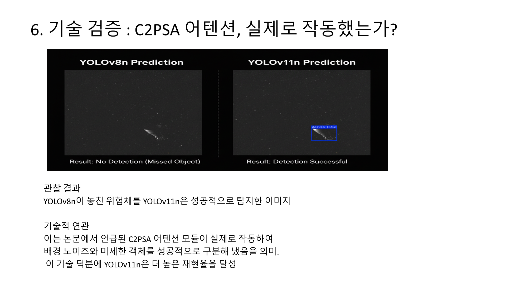
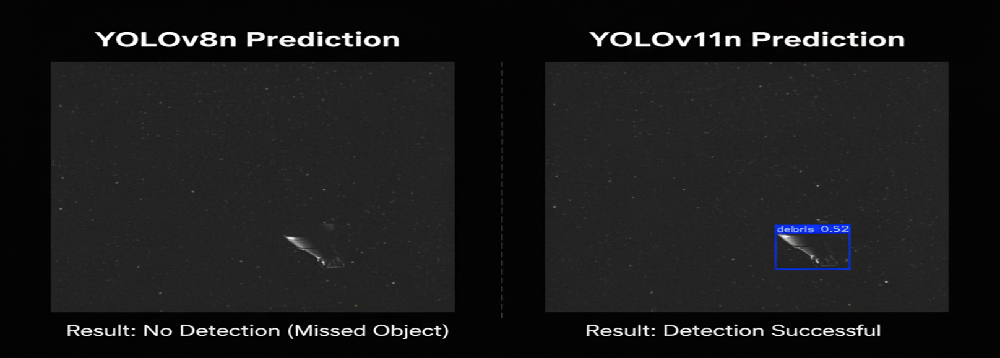

# space-debris-detection-yolo
# YOLOv8 vs. YOLOv11: 우주 위험체 탐지 성능 비교 분석



## 1. Abstract (초록)
본 프로젝트는 표준 객체 탐지 모델인 YOLOv8과 최신 연구 모델인 YOLOv11의 성능을 '우주 위험체 탐지'라는 특정 과업에 대해 비교 검증했습니다. 동일한 데이터셋과 학습 조건 하에서, YOLOv11이 더 높은 재현율(Recall)을 보여 '위험체 누락 방지'라는 핵심 목표에 더 부합함을 입증했습니다. 이 과정을 통해 최신 모델의 기술적 장단점을 실제 환경에서 비판적으로 분석하고, 프로젝트 목표에 따른 최적의 모델을 선정하는 전략적 의사결정 과정을 제시합니다.

## 2. Motivation (연구 동기)
증가하는 우주 위험체는 실제 운영 자산을 위협하는 심각한 문제입니다. 최신 모델인 YOLOv11의 성능 향상 주장이 실제 특정 도메인(우주 위험체)에서도 유효한지, 표준 모델인 YOLOv8과 공정하게 비교하여 검증할 필요가 있었습니다.

## 3. Hypothesis & Experiments (가설 및 실험 설계)
* **가설:** YOLOv11 논문에서 제안된 C2PSA 어텐션 메커니즘은 작은 객체 탐지 능력을 향상시켜, YOLOv8 대비 더 높은 재현율(Recall)을 보일 것이다.
* **실험 설계:** 가설 검증을 위해, 아래와 같이 모든 변수를 엄격하게 통제하여 두 모델의 순수한 성능 차이만을 측정했습니다.
    * **데이터셋:** 'debris' 단일 클래스 데이터셋으로 통일
    * **모델:** `YOLOv8n` vs `YOLOv11n` (동일 사이즈)
    * **학습 파라미터:** `Epochs: 50`, `Image Size: 640x640` 등 모든 조건 통일
    * **최종 평가:** 훈련/검증에 사용되지 않은 Test Set으로 최종 성능 측정

## 4. Results (결과)
### 4.1. 정량적 평가 (Quantitative Evaluation)
Test Set에 대한 최종 성능 비교 결과는 아래와 같습니다.

| 모델 (Model) | mAP@50 | mAP@50-95 | **Precision (정밀도)** | **Recall (재현율)** | **Inference Speed** |
| :--- | :--- | :--- | :--- | :--- |:--- |
| **YOLOv8n** | **0.784** | **0.471** | **1.0** | 0.630 | **4.4ms** |
| **YOLOv11n** | 0.734 | 0.462 | 0.881 | **0.727** | 5.4ms |

### 4.2. 정성적 평가 (Qualitative Evaluation)
**[사례 1: YOLOv11의 높은 재현율 (어텐션 메커니즘 효과)]**
*YOLOv8n이 놓친 작은 위험체를 YOLOv11n은 성공적으로 탐지했습니다.*


## 5. Conclusion (결론 및 향후 연구)
### 5.1. 결론
단순 mAP 점수와 속도는 YOLOv8n이 우세했으나, YOLOv11n은 최신 어텐션 기술을 통해 **'놓치지 않는 능력(재현율)'에서 명백한 기술적, 실용적 우위**를 보여주었습니다. '위험체 누락 방지'라는 프로젝트 목표에 따라, **YOLOv11n을 최종 베이스라인 모델로 선정**했습니다.

### 5.2. 향후 연구
선정된 YOLOv11n 모델의 약점(낮은 정밀도, '숨겨진 오탐')을 보완하고, 최종 목표인 11종 다중 클래스 모델로 확장하는 연구를 진행할 계획입니다.

## 6. 재현 가이드 (Reproducibility Guide)

### 1. 환경 설정 (Environment Setup)
```bash
# 1. Clone this repository
git clone [https://github.com/](https://github.com/)[ljh940620]/space-debris-detection-yolo.git
cd space-debris-detection-yolo

# 2. Create and activate conda environment
conda create -n space_torch python=3.9
conda activate space_torch

# 3. Install required libraries
pip install -r requirements.txt
```

### 2. 데이터셋 준비 (Dataset Preparation)
1.  [여기](https://www.kaggle.com/datasets/muhammadzakria2001/space-debris-detection-dataset-for-yolov8)에서 11종 클래스 데이터셋을 다운로드 받아 `data` 폴더에 압축을 해제합니다.
2.  아래 스크립트를 실행하여 'debris' 단일 클래스 데이터셋을 생성합니다.
```bash
python src/data_preparation/prepare_debris_only_dataset.py
```

### 3. 모델 훈련 (Model Training)
```bash
# To train YOLOv8n model
python src\train\debris_only_run/train_yolo8_debris_only.py --model yolov8n.pt --name debris_yolov8_run

# To train YOLOv11n model
python src\train\debris_only_run/train_yolo11_debris_only.py --model yolov11n.pt --name debris_yolov11_run

### 4. 최종 평가 (Final Evaluation)
```bash
python src/evaluate/evaluate_final.py
```

### 1주차: 베이스라인 모델 선정 및 성능 비교
- **목표:** YOLOv8n과 YOLOv11n의 기본 성능을 비교하여 프로젝트의 베이스라인 모델 선정.
- **수행 내용:** 동일한 데이터셋과 학습 조건 하에 두 모델을 훈련하고, Test Set으로 최종 성능 평가 진행. (`evaluate_final.py`)
- **주요 결과:** YOLOv11n이 재현율(Recall)에서 0.727로 YOLOv8n(0.630) 대비 명백한 우위를 보임. 이는 '위험체 누락 방지'라는 핵심 목표에 더 부합함.
- **결정:** YOLOv11n을 2주차 개선 대상 모델로 최종 선정.